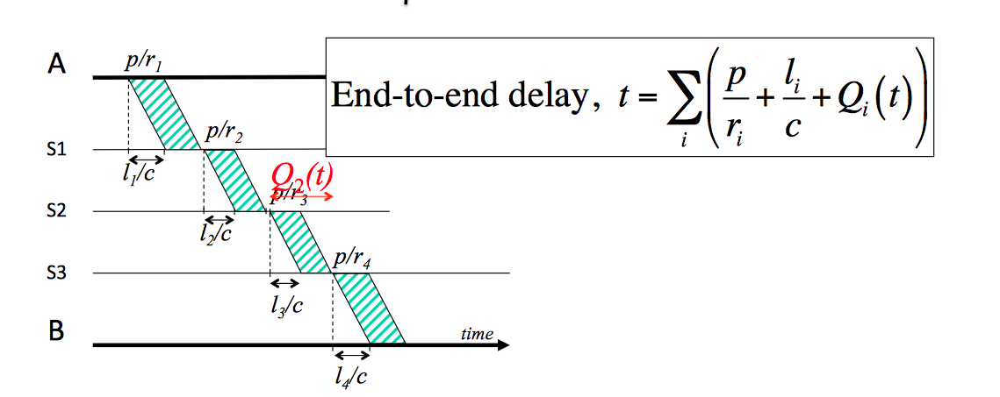
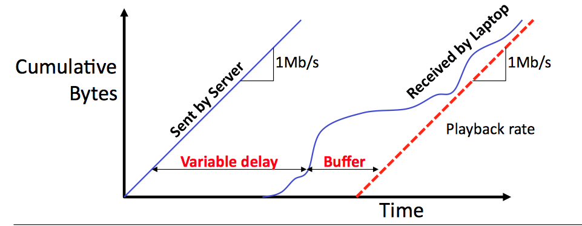

# Packet Switching 

## History
#### History of networking
* 2000 BC -> Fire, ON or OFF
* 1600 -> Systems to transmit arbitrary data, encoding the alphabet
* 1700 -> Protocols fo understanding each other

First protocol signals in 1800s:
Via telegraph
* Error handling
* Flow control

1900, Alexander Graham Bell made the first telephone call, allow

#### History of the internet
* 1960 -> JCR Licklider, MIT professor, starts explaining this concept of a global network. First papers about large scale communication networks: network theory and queues theories.
* 1965 -> First MAN network via telephone line created joining computers in California and Massachusets.
* 1969 -> First nodes in US. DARPAnet, propietary network.
* 1974 -> DARPA. Vinc Cerf writes paper on A protocol for Packet Network communication. 
* 1979 -> IP and TCP were separated. 
* 1983 -> IP and TCP deployed.
* 1989 -> 100k connected hosts. 
* 1990 -> Tim Berners Lee, invents www.
* 1993 -> Marc Andressen, first web browser.
* 1999 -> Amazon, Google, Ebay.

To learn [more](http://www.cs.ucsb.edu/~almeroth/classes/F10.176A/papers/internet-history-09.pdf)

## Definition
How packets are routed hop by hop in the internet until it arrives at its final destination. First described in the 1960s.
#### Circuit switching
Telephones were connected through a dedicated wire that went to a switching center which connected it to the dedicated wire in the destination.

Now there's a dedicated circuit that automatically connects both ends. The path is not shared with anyone else. When call is hung up, state in switches in the middle is cleared, so another communication can be made.

Every phone call has it's own circuit. Between cities, we put a fiber optic wire that can hold multiple dedicated circuits at a time. 

Problems porting it to computers:

* Ineficiency -> In computers we don't usually need to hold the connection and connect to multiple things at a time, not having a continuous connection like a phone call.
* Diverse rates -> It is not the same a SSH connection sending a char per second, versus a video streaming that requires a much bigger data flow.
* State management

#### Packet switching
There's no dedicated circuit to carry data. We sent data by adding a header to it that indicates where the packet is going.

It is routed hop by hop. Each packet switcher uses a forwarding table.

Types: 
* Routes
* Ethernet switches

Packet switches have buffers to hold packets in case packets arrive at the same time, because the switch has to process each packet independently.

The only state that has to be saved is the forwarding table and not the whole network state.

Packet switching allows the resilence to failure of links and routers, if the link breaks we can send it to another switch and the message could be easily rerouted. 

#### Definitions
* Propagation delay -> time that takes a bit to travel. It is determined by how long the link is and the speed. *t = l / c*
* Packetization delay -> time from when the first bit to the last bit of a packet is transmited. *t = p / r* r is the rate at which we can put bits per seconds to the link. A 1kbit packet takes 1.024s to go through a 1kb/s link. It is only a function of the length of the packet and the speed we can put bits to the link. 

#### End to end delay
Time between we send the first bit in the source, to the time the last bit arrives at the end. This will be the sum of the propagation delay plus the packetization delay.

This is because internet switches generally wait for the entire packet to arrive until they forward it.

This is not that simple, because internet switches have multiple packets come at a time, so then they have to wait in the switch queue. First-come-first-serve queue, this means that the first one to arrive will be the first packet switched. This is how the internet MUST work in order for it to be equal for everybody, NO FAST LANES!

This delay when a packet is in the queue makes our function more complicated, because we maybe need to wait for n packetization delays for all packets that arrived before us. This makes the queuing delay unpredictable, all the other factors are deterministic. 

The further the packet goes, the more likely it is have more delay, because it has to go through more hops and has more probability of encountering other packets in this switches.

#### Playback buffer
Some realtime apps (skype, youtube) really care about delays. 

Because the apps aren't sure that the packets are going to arrive on time, they have to create a playback buffer.

In youtube for example, when you are loading a video, the client tries to get ahead the packets it will need in the future that might be delayed.

When streaming a video from youtube, the server will sent packets with a constant packetization and propagation delay, but the queuing delay is random, so the time it takes to receive the packets varies and it is not constant. 

We can know the amount of time between when we got the byte until we have to reproduce it.

#### Deterministic queue model
Routers have to have queues in the interface to tackel moments with congestion. 

Packets come from multiple interfaces and they depart from the link, which has a deterministic rate.

* A(t) -> Bytes arrived, they arrive at a concret byte arrival rate, given by the packet that holds the bytes. 
* Q(t) -> Bytes waiting
* D(t) -> Bytes departed at a constant rate.

You can easily sketch A(t) and D(t), and we can calculate the size of *Q(t) = A(t) - D(t)* that is the bytes that have arrived but haven't departured yet. 

d(t) is the time spend in the queue of a byte arriving at time t, which is the distance between A(t) and D(t)

##### Why small packets reduce queues?
Because the time you spend on the queue depends on how the delay on sending the packets that arrived before you, if packets are smaller, queues will be shorter. And this will reduce the end to end delay at the end.

#### Queues with Random arrival processes
Queuing theory.

Properties:

* Burstiness increases delay -> because that can make us miss departure oportunities. In two scenarios we have a rate of 1 packet per second in arrival and departures. In case 1, packets arrive one second at a time, so the queue size will be ≤ 1. In case 2, n packets arrive each n seconds. We have the same rate, but we can only deliver one packet per second so our queue will be ≤ n. This demonstrates that burstiness increases queues, delays.
* Determinism minimizes delay
* Little's result -> The average number of the queue = is the average delay of customers times the average arrival rate. The Poisson process can aggregate many independent random events. But though networking traffic is not Poission, it can model quite well the arrival of new flows. *L = arrival rate times delay*
* M/M/1 queue -> *delay = 1/(departureRate - arrivalRate)* ? 

## Switching and forwarding

Steps:

* Looking up address to figure out which is the next hop.
* Update header -> Change TTL in IP.
* Queue in departure link

#### Ethernet switch 

###### Steps

* Examine header
* If the dest add is in the forwarding table, forward it to the correct output port.
* If it's not, broadcast the frame to all ports, except the one which the frame arrived.
* Forwarding table is updated when the packet goes back.

###### Lookup address

* Stores the address in a hash table (maybe a 2 way)
* Looks for a exact match in the forwarding table
* If it doesn't get a match, ethernet switches broadcasts.

#### IP router
###### Steps

* Check if the ethernet DA belongs to us, if not drop it.
* Examing version number and check checksum
* Update TTL and compute new checksum of the IP packet
* Check TTL != 0
* If the IP address is in the forwarding table.
* Find the Ethernet DA for the IP DA
* Send it

###### Lookup address
It is not a hash table, because it doesn't have to be a pure match. 
When multiple entries in the table match, we will use the Longest prefix match to check what entry of the table did a more exhaustive description of the destination and sends it to this one. Because it is assumed that if we do a more exhaustive description of an IP address, it will mean that this one is closer to the final destination for the packet.

#### Switching packets to the egress port
###### Output queued packet switch
When N packets come that have to be delivered at a rate R, we hold them in memory before sending them in the output. The problem is that we need to have an output queue of N*R capacity.
###### Input queued packet switch
There's no queue at the output, so when the output line is busy, input holds only the packet til the output is free and can send the packet.

Problem: Head of line blocking. We have outputs free, but we block the router with packets that have to go to a busy output.

###### Virtual Output Queues
Each input has a queue for each packet going to a determined output. So we don't have the problem of head of line blocking other outputs.
