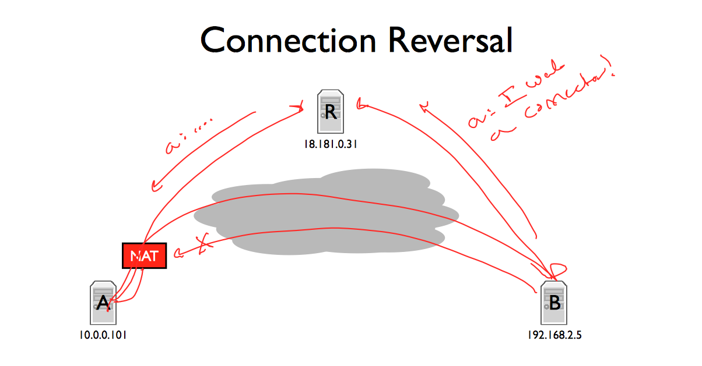
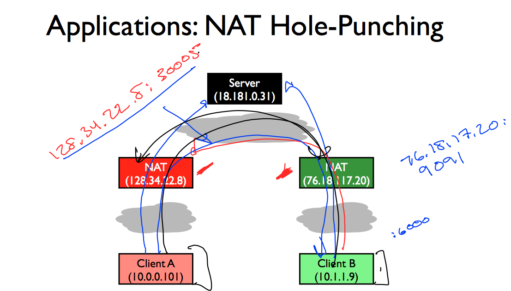

##NATs
Allow a network to be 'hidden' and have a private network that then can face the public.

It is something that sits between us and the internet. The NAT will rewrite the packet changing the source address to its external interface address, so for the internet it is the NAT who is sending the packet, but when it gets the response back it knows where to send it. 

It is a way for a bunch of nodes to share an IP address. It kind of provides a firewall, so it's hard for attackers to open directly connections with your computer.

It basically sets a mapping among internal IP and port, to a unique external and a port. 

The NAT normally doesn't create a map until it sees a packet from the inside going to the outside world.


####Types of NATs

* Full Cone NAT -> allows a lot of stuff to be traversed. It basically maps a port of its external interface to a given port in the internal network and every single packet that arrives is traversed.
* Restricted Cone NAT -> the mapping is restricted to the IP that was made the original connection to. It means that the mapping is not openned to every thing coming to the port. 
* Port restricted NAT -> it is restricted to only translate connections coming from the same IP and port. 
* Symmetric NAT -> it is port restricted. Different destinations receive different mappings, even if the internal interface address and port is the same. 

###### Hairpinning

When two nodes are in the same private network and one sends a packet to another using their external IP address it will need to go through the NAT to get the internal IP address of the destination. When sending the response back, the packet will have to go back through the NAT so that we get a packet from the host we requested it, it will break the system instead.


#### NAT implications
It doens't allow incoming connections. If you don't cordinate OK, if you are connecting to a web server, the web server cannot open a SSH connection in your computer back.

This can be solved by both ends being connected to another server and then when the destination wants to open a connection it talks to this server which both are connected to and the A opens a connection to B, and not the other way around.


###### NAT hole punching
For not full cone nats, the connection has to be done at the same time from both ends, so the mapping is created when the other connection arrives.

This will not work with symmetric, because port in the NAT won't be reused.


###### NAT debate
It requires on the Transport protocol to get source and destination ports, so is a NAT doesn't know the transport protocol it drops the packet. So there's no space for innovation in the transport layer becuase if it is not accepted by NATs packets will not work in the real world.

#### NAT operations
The NAT itself could respond to connections, not only map. For example, having a web configuration interface.


## DNS
#### History 
HOSTS.TXT -> File to map IPs to hosts
#### Domain name system
* Map names to values
* It needs to map a huge amount of IP addresses
* Distributed. But robust, so if one node is down the thing still works.

###### Design
* Read most -> a slight delay is accepted. 

This allows extensive caching in DNS

###### Architecture
* Hierachical zones starting in a root zone devided in TLDs.
* The root zone consists on 13 servers which are highly replicated. 

###### DNS queries
We send a request to our DNS resolver. If there's no cache at all, it will ask a root server for the TLD. Then the resolver will talk to the TLD to get the host. Then we ask the host for the specific subdomain.

The resolver will cache every one of this requests, so if we need some piece of information again.

###### Resource records

*name [TTL] [class] [type] [rdata]*

#### DNS message structure

* Header -> 12 bytes. 

* Question
* Answer
* Authority
* Additional

IP compresses names because they can appear multiple times in the packet that can only be 512 bytes long.

###### Example

Doing DNS requests as if there was no cache.

```.sh
	$ dig +norec izqui.me  @a.root-servers.net
	> ... me.			172800	IN	NS	ns2.nic.me. ...
	$ dig +norec izqui.me  @ns2.nic.me
	> ... izqui.me.		86400	IN	NS	ns1.hover.com. ...
	$ dig +norec izqui.me  @ns1.hover.com
	> ... izqui.me.		900	IN	A	37.139.13.92	
```

#### CNAME
Canonical name, tells you a name is an alias.

#### MX
Mail eXchange record.

## DHCP 
For communicating with IP you need: 
* IP address
* Subnet mask
* Gateway

DHCP servers are used for providing a new member on the network with the configuration it will need to connect to the internet.

Flow: 
Discover -> Offer -> Request -> Ack -> Release


